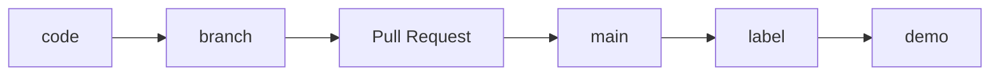
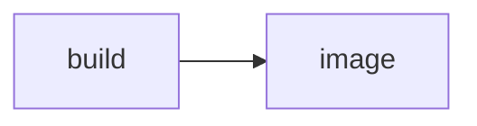

# Numocity developers manual

[Development gates](gates.md)

[Commit flow](commit-to-cust-flow.md)

[Write code for easy reading](naming.md)

[Write tests to express intent](tests.md)

## Commit flow

### Branch

Before committing the code, run `git checkout -b` _name-your-branch_

Naming your branch: Use the ticket number followed by the part which you are solving.
E.g., 

## Build flow

