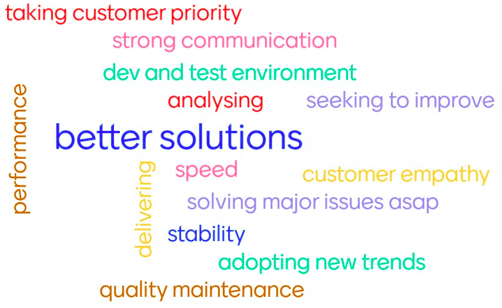

# Numocity developers manual

We're responsive!

## Development flow

> Development: The activity of refining customer needs, ending in a deployment.

[Requirement grooming](grooming.md) - Work in progress

[Development gates](gates.md)

[Commit flow](commit-to-cust-flow.md) - Work in progress

## Constraints

Constraints provide guard-rails to product-requirements.
They override external mandates, including customer requests and standards.

[Compatibility](compatibility.md)

[Access control and Privacy](access-control-privacy.md)

## Clean-coding blogs

[References](references.md)
