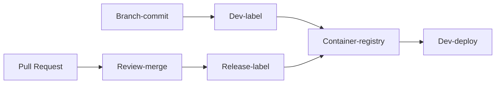
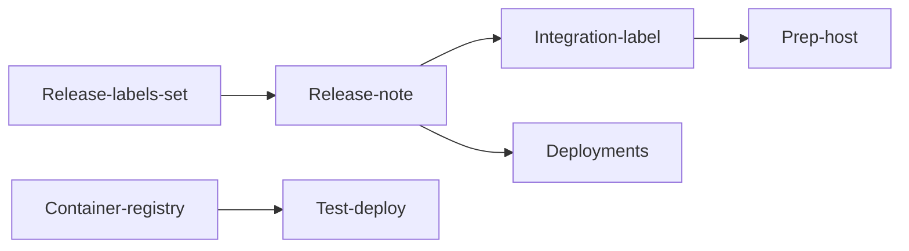

# Commit flow

## Configuration management (TODO)

- Flow of environment from development to test / production
- Configuration of firewall
- Configuration of API gateway
- Change of environment for test
- Change of environment for debug

## Development

### Branch-commit

Before committing the code, run `git checkout -b` _name-your-branch_

Choose a name that conveys the value delivered by the branch.

### Dev-label

Once unit-tests pass, apply a development-label.
Example: BR.16.0.1

Applying a label will automatically make an image in the container registry.

### Dev-deploy

Test your fix on the development environment ('dev-fusion'). Find and fix regressions.

### Pull-request

Raise a pull request using [the template](https://github.com/numocityadmin/nodejs-template/blob/main/.github/pull_request_template.md).

### Review-merge

Focus on the following during the review:

1. _Readability_: Is the code understandable without explanation? Including test-code.
1. _Resource needs_: Will a high frequency of requests bring the server down?
1. _Vulnerabilities_: SQL injection, CORS

In case of merge-conflicts, repeat the `Dev-deploy` step above.

### Release-label

This need not happen for every merge. Merges for release need labelling

Example of a release label: SP.16.5.0

## Release for testing

### Test-deploy

1. Generate release notes with the last deployment as reference. Source of info: Pull-requests from all packages changed since the last release.
1. Setup the test system according to the release notes. Re-deploy the marked services, resulting in a deployment-record
1. Record test-results and keep with the deployment-record.
