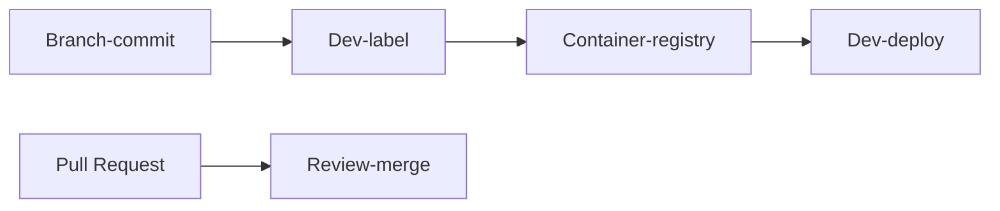

# Commit flow

## Principles

- Maintain deployment-record = snapshot of the environment on the VM, for every deployment
- Record test-results. They stay with the deployment-record
- Any merge into main is good-to-go for test and deployment

Recommended for efficiency:

- Frequent merge to main (max life of a branch is 3 days)
- Automate the setup and test steps

## Development

### Branch-commit

Before committing the code, run `git checkout -b` _name-your-branch_

Choose a name that conveys the value delivered by the branch.

### Dev-label

Once unit-tests pass, apply a development-label.
E.g., BR.16.0.1

Applying a label will automatically make an image in the container registry.

### Dev-deploy

Test your fix and ensure no regressions.

### Pull Request

Raise a pull request as per [the template](https://github.com/numocityadmin/nodejs-template/blob/main/.github/pull_request_template.md).

### Review-merge

Focus on the following during the review:

1. _Readability_: Is the code understandable without the author being present? Including test-code.
1. _Resource needs_: Will a high frequency of requests bring the server down?
1. _Vulnerabilities_: SQL injection, CORS

In case of merge-conflicts, repeat the `Dev-deploy` step above.

## Release for testing

### Release-label

This need not happen for every merge. Only merges that are candidates for release need to be labelled

Example of a release label: SP16.5.0

### Test-deploy

1. Generate release notes with the previous deployment as reference. Source of info: Pull-requests from all packages changed since the previous release.
1. Setup the test system as per the release notes. Re-deploy the marked services, resulting in a deployment-record
1. Record test-results and keep with the deployment-record.
