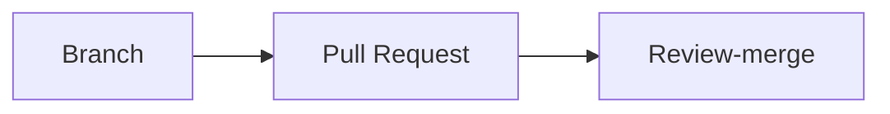
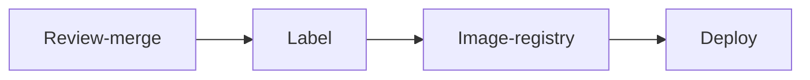

# Commit flow

### Branch

Before committing the code, run `git checkout -b` _name-your-branch_

Naming your branch: Use the ticket number followed by the part which you are solving.
E.g., TODO

## Pull Request

Raise a pull request with the following details:

1. The part of the ticket addressed by this Pull Request
1. External interfaces changed
1. Changes to environment variables
1. Changes to gateway
1. Increase in resource needs (E.g., large queries, disk space)

## Review-merge

Focus on the following during the review:

1. Is the code understandable without the author being present?
1. Increase in resource needs: Will a high frequency of requests bring the server down?
1. Vulnerabilities: SQL injection, CORS

## Label

This need not happen for every merge. Only merges that need to be taken to integration (e.g., with front-end) need to be labelled

Example of a label: SP13.5.0

## Image-registry

Publish a label to the Image-registry to make it available for deployment

## Deploy

Deploy according to customer specifications (hosts, gateway, payment settings, licenses) TODO
