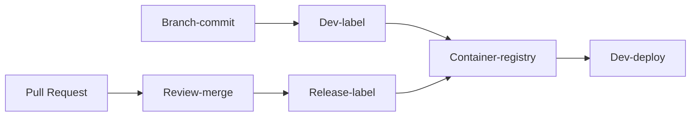
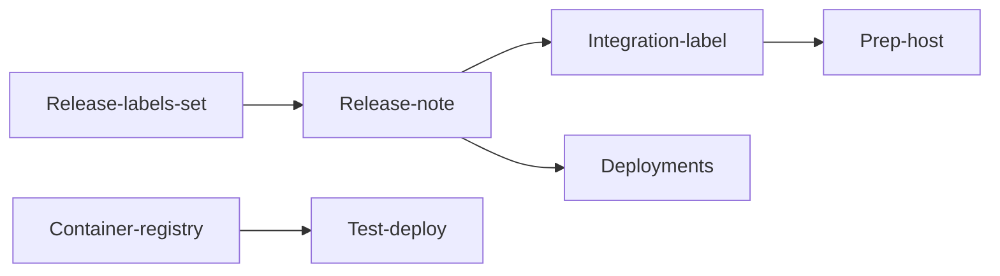

# Commit flow

## Configuration management (TODO)

- Flow of environment from development to test / production
- Configuration of firewall
- Configuration of API gateway
- Change of environment for test
- Change of environment for debug

## Development

### Branch-commit

Before committing the code, run `git checkout -b` _name-your-branch_

Choose a name that conveys the value delivered by the branch.

### Dev-label

Once unit-tests pass, apply a development-label.
Example: BR.16.0.1

Applying a label will automatically make an image in the container registry.

### Dev-deploy

Test your fix on the development environment ('dev-fusion'). Find and fix regressions.

### Pull-request

Raise a pull request using [the template](https://github.com/numocityadmin/nodejs-template/blob/main/.github/pull_request_template.md).

### Review-merge

Focus on the following during the review:

1. _Readability_: Is the code understandable without explanation? Including test-code.
1. _Resource needs_: Will a high frequency of requests bring the server down?
1. _Vulnerabilities_: SQL injection, CORS

In case of merge-conflicts, repeat the `Dev-deploy` step above.

### Release-label

This need not happen for every merge. Merges for release need labelling

Example of a release label: SP.16.5.0

## Release for testing

### Test-deploy

1. Generate release notes with the last deployment as reference. Source of info: Pull-requests from all packages changed since the last release.
2. Setup the test system according to the release notes. Re-deploy the marked services, resulting in a deployment-record
3. Record test-results and keep with the deployment-record.

## Configuration of Environmental Variables

### First-time setup

Environmental variables driven by services:

1. .env.ncms.regular : Environmental variables used by one or more services are put by developers into this file. Developers update this file on devfusion. Admin or testers copy the same to .env.ncms.regular file of CMS-Test repository.
2. .env(service-level) : Environmental variables which belong to particular services are put by developers into the file named `.env` present in the service repository.

Environmental variables driven by target-system: (Keeping devfusion as reference)

3. Site-specific : Environmental variables which have tokens or host names present in them and belong to a particular instance. This is to be set as Repository level secret. This is currently updated by the organization admins. 
Step 1: collect the environmental variables names used in devfusion site-spec.
Step 2: Take the value of those environmental variables names for the target-system, and update the same to target-system SITE_SPEC_ACCESS secret.
4. Payment gateways : Payment gateway Environmental variables are also set into Repository level secrets. This is currently updated by the organization admins.
Step 1: Find the payment gateways applicable to the target-system.
Step 2: Take the env name & value of those payment gateways from devfusion, and update the same to target-system PGW_KEYS secret.

NOTE: Currently Envs are categorized manually. 

Release of env related changes:

Before release (during development): Developers mail changes to site-specific or payment gateway envs to admins. Admins update both secrets and template of devfusion.
During release: Developers when a new env has been created they mention it in the release notes. 
After release: The tag has been given to devfusion repository. Tag matches the release note sheet version.
The envs which are put on secrets can be accessed on instances.   

## Migration of environment variables 
NOTE: when the developer sends out a release note with the services to be tested along with the tag, that means the service is already built with that tag, image is created & stored in the azure registry. No need to build the services again, just deployment is enough. 

Step 1: Before the Deployment make sure .env.ncms.regular of CMS-Test repository is same as .env.ncms.regular of devfusion release tag.
Step 2: Any host-VM specific envs or payment gateway envs are mentioned in release notes are to be put into CMS-Test repository SITE_SPEC_ACCESS_TEST or PGW_KEYS_TEST secrets respectively. Testers will be given access to set the repository secrets. 
Step 3: In the CMS-Test repository, go to actions and select “deploy_on_test_VM” workflow. Workflow dispatch event will get triggered and manual inputs can are given under ` Run workflow `. The first input : the tag mentioned in the release note for a particular service. The second input : the service which can be chosen from the drop down menu. Click run-workflow. 
Step 6: After every service is deployed through git-actions remove .env.ncms and .env.ncms.common from test system.

