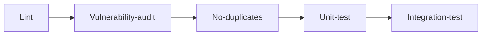

# Development gates

Development gates work at the repo level to catch issues early

## Lint

### Inputs

All inputs to Lint are in the repo itself:

1. Source code and Dependencies (`package.json`)
1. Linting rules

Minimum linting rules:

- [Google Javascript style guide](https://www.npmjs.com/package/eslint-config-google)
- [ESLint recommended](https://github.com/eslint/eslint/blob/main/conf/eslint-recommended.js)
- Maximum cyclomatic complexity in a function: `3`
- Maximum line length: `100` characters
- Do not require jsdoc

### Outputs

- Fail on any findings + errors with line-numbers

>Zero linter-findings, no exceptions

## Vulnerability-audit

### Inputs

1. Source code and Dependencies (only production)
1. `npm audit` with [GitHub Advisory Database](https://github.blog/2021-10-07-github-advisory-database-now-powers-npm-audit/)

### Outputs

- Fail on any Vulnerabilities (Critical, Major, Average, Minor)

>Zero vulnerabilities

>Exception: Temporary till 3rd party release is available, discussed at [Requirement](grooming.md#Requirement) level

## No-duplicates

### Inputs

- Source code and Dependencies

### Outputs

- Fail on any duplication

>Zero duplicates of >3 lines / 45 tokens within the repo

## Unit-test

### Inputs

- Source code and Dependencies

### Outputs

- Fail on any unit-test failure

>100% line, branch and function coverage

>Exception: Where the dependency is the functionality (E.g., code-lines that pushes files to S3 bucket). Reviewed at pull-request

## Integration-test

### Inputs

- All service repos
- Tests, as determined by developer TODO

### Outputs

- Local integrated environment to test end-to-end flow.
