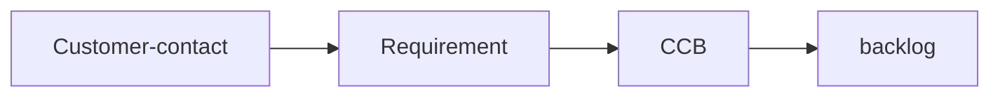

# Requirement grooming

## Requirement

### Inputs

_Statement-of-intent_ from customer-contact, or _Technical-constraint_ from dependencies (example- vulnerabilities).

### Output

_Requirement-minutes_ containing:

1. Inconsistency with other requirements, especially role-based access
1. Possible violation of country-specific laws
1. Possible introduction of vulnerabilities
1. Press release

## CCB

### Inputs

_Requirement_ minutes

### Output

_Backlog_ containing:

1. Flow of information to the application (Mobile, web, API client...)
1. Test cases

_Ticket(s)_ containing:

1. Acceptance criteria per service
